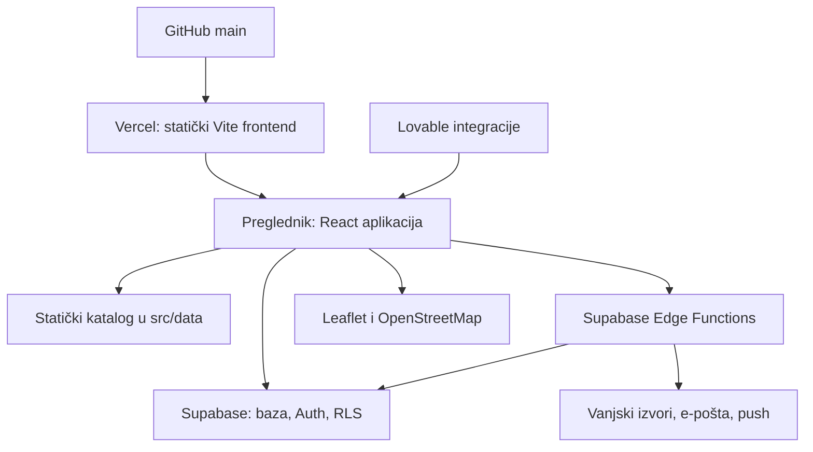

# ZadarIQ — pregled i preuzimanje projekta

Provjereno 27. rujna 2026. Osnova: `e3436aa1d08b32c1a5316368d7ee24607bed44e1`.
Ovo je mapa postojećeg sustava i otvorenih provjera, ne potvrda da su sve produkcijske postavke provjerene.

## Repozitorij i objava

| Stavka | Potvrđeno stanje |
| --- | --- |
| GitHub | https://github.com/antel75/zadariq — javni repozitorij |
| Glavna grana | `main`, GitHub javlja `protected: false` |
| Pristup GitHubu | Povezani račun ima admin/push/pull ovlasti |
| Lokalna kopija | `/Users/antelucin/zadariq`; bila je 140 commitova iza GitHuba, usklađena fast-forward postupkom |
| Javna domena | https://zadariq.city preusmjerava na https://www.zadariq.city/; početna i radar otvoreni u pregledniku |
| Vercel | projekt `zadariq`, prostor `antlucin-4679s-projects` prema GitHub statusu objave |
| Posljednja pronađena produkcijska objava | GitHub deployment `6659805119`, commit `e3436aa`, status `success`, 2026-09-25 11:37:08 UTC |
| Adresa te objave | https://zadariq-5yelq3hpo-antlucin-4679s-projects.vercel.app |
| Supabase projekt u kodu | `yxfaovaigwdbziewnppx` |
| CI u repozitoriju | Nema praćenih GitHub Actions workflow datoteka |

GitHub zapis potvrđuje produkcijsku objavu. To samo po sebi ne potvrđuje aktualne postavke domene, DNS-a, build okruženja ili sigurnosnih kopija. Vercel i Supabase integracije sada su dostupne, ali njihove veze nemaju potvrđen pristup ZadarIQ resursima; rezultati provjere su ispod.

### Provjera povezanih računa, 27. rujna 2026.

- **Vercel:** popis timova vraća prazan popis. Dohvat poznate produkcijske objave vraća HTTP 403 za `antlucin-4679s-projects`, ID `team_qctaFs2K45k1e0GsLvTW3ufs`, uz poruku da treba ponovno autorizirati taj prostor. Potrebno je povezati račun/ovlasti za taj prostor; sama instalacija integracije nije osigurala pristup projektu.
- Vercelov dohvat projekta dodatno ima nesklad konektora: javna shema očekuje `projectId`, a pozadinska validacija traži `idOrName`. I nakon pokušaja s oba polja zahtjev pada. To je zaseban problem alata, ne dokaz o stanju projekta.
- **Supabase:** popis dostupnih projekata ne uključuje ZadarIQ. Izravan dohvat `yxfaovaigwdbziewnppx` vraća zabranu pristupa. Potrebno je potvrditi račun/organizaciju vlasnika tog projekta i uključiti ga u autorizaciju veze.
- Korisnik je potvrdio: ZadarIQ backend je Lovable Cloud, EU regija, najmanji paket (prema Lovableovoj informaciji). Nije na njegovu samostalnom Supabase računu. Administrativne promjene baze, funkcija i obavijesti izvršava Lovable. Preview i produkcija koriste istu bazu; provjere prikaza raditi čitanjem. Nije potrebna migracija za frontend redizajn.
- Nijedna produkcijska postavka ni podatak nisu promijenjeni tijekom ovih provjera.

## Arhitektura

React 18, TypeScript, Vite 5, Tailwind, shadcn/ui, React Router, TanStack Query. Nema zasebnog klasičnog aplikacijskog servera u repozitoriju. Serverski dio je uglavnom u Supabase Edge Functions; postoji i Lovable MCP integracija u Viteu i Supabaseu.

| Dio | Gdje se nalazi | Uloga |
| --- | --- | --- |
| Pokretanje i rute | `src/main.tsx`, `src/App.tsx` | Provideri, rute, odgođeno učitavanje nekih stranica |
| Početna | `src/pages/Index.tsx`, `src/components/dashboard/HomeDashboard.tsx` | Rezident/turist, pretraga, radari, gradski blokovi |
| Radar | `src/pages/CityRadar.tsx` | Aktivni slojevi, lokacija, datum, spajanje rezultata |
| Karta i popis | `src/components/radar/{RadarMap,RadarSheet,LayerChips}.tsx` | Leaflet karta, donji panel, filtri |
| Podaci radara | `src/lib/radar/` | Tipovi, registar slojeva, katalog, otvorenost |
| Katalog | `src/data/mockData.ts`, ostali `src/data/*` | Stvarni nazivi/adrese pomiješani sa statičkim i simuliranim metapodacima |
| Baza u frontend kodu | `src/integrations/supabase/{client,types}.ts` | Klijent i generirani tipovi; tipovi nisu dokaz aktualne sheme |
| Prijava | `src/hooks/useAuth.ts`, `src/integrations/lovable/` | Supabase sesija, provjera admin uloge, Lovable OAuth |
| Administracija | `src/pages/AdminPanel.tsx`, `src/components/admin/` | Radna vremena, nedjelje, objekti, zdravstvo, događanja i obavijesti |
| Vlasnici | `src/pages/owner/` | Profil, zahtjevi za vlasništvo, uređivanje i ponude |
| Gradski sažetak | `src/pages/ZadarDanas.tsx` | Sažetak dana; odvojen od radara |
| Serverske funkcije | `supabase/functions/` | 25 direktorija funkcija, ne računajući `_shared` |
| Migracije | `supabase/migrations/`, `drizzle/migrations/` | 35 Supabase SQL datoteka i zasebna Drizzle migracija |
| SEO | `src/components/PageSEO.tsx`, `scripts/generate-sitemap.ts`, `public/` | Canonical, sitemap, robots i llms |
| Objavljivanje SPA | `vercel.json` | Sve rute preusmjerava na `index.html` |

## Radar: stvarno aktualno stanje

`/radar` otvara CityRadar. `/sunday-radar` preusmjerava na `/radar?layer=sunday`. Oba bannera na početnoj vode na isti sustav. Parametar `layer` dodaje sloj spremljenim ili zadanim slojevima: **ne izolira nužno samo nedjeljni sloj**.

Slojevi: otvoreno sada, radna nedjelja, ljekarne, gorivo, EV punjači i parking. Zadano su uključeni otvoreno sada i nedjelja. Karta preuzima Leaflet i marker clustering s unpkg CDN-a te pločice s OpenStreetMapa. Donji panel počinje na 84 px visine. Lokacija se traži pri ulasku, a udaljenost je zračna, ne vrijeme ili duljina stvarne rute.

| Skup podataka | Izvor i tok |
| --- | --- |
| Osnovni objekti | `mockData.ts` + odobreni `pending_places`, zajednički loader `src/lib/radar/places.ts` |
| Izmjene radnog vremena | `business_hours_overrides` + funkcije u `mockData.ts` |
| Nedjelje | `shop_sunday_schedule`; poslovnice povezane preko statičkih ID-eva ili prefiksa `ap_` |
| Uvoz nedjelja | `scrape-sunday-shops`: radne-nedjelje.com → geokodiranje Nominatim → poslovnice/raspored/status uvoza |
| Dežurstva | `duty_services`; radar povezuje ljekarne po normaliziranom nazivu |
| Zdravstvo | `health_places` i `useHealthPlaces`; radar ljekarni trenutačno koristi svoj kataloški tok |
| EV | `ev_chargers`, izvještaji u `ev_charger_reports` |
| Događanja i sport | `city_events`, `sports_events`, više scrape/fetch funkcija |
| Komunalne informacije | `power_outages`, `water_outages`, `city_alerts` |
| Vlasnici i ponude | `owner_profiles`, `business_ownership`, `ownership_claim_requests`, `business_offers`, audit/pending tablice |
| Push | `push_subscriptions`, `public/sw.js`, `send-sunday-push`, `send-morning-brief` |

## Okruženja, ključevi i rasporedi

- Frontend treba `VITE_SUPABASE_URL` i `VITE_SUPABASE_PUBLISHABLE_KEY`. Lokalno pri pregledu nije bilo `.env` datoteke ni tih varijabli u procesu.
- Serverske funkcije koriste Supabase URL, anon/publishable i service-role ključ; ovisno o funkciji i `RESEND_API_KEY`, `LOVABLE_API_KEY`, `API_FOOTBALL_KEY`, `THESPORTSDB_KEY`, VAPID ključeve i njihove V2 inačice. To su nazivi iz koda, ne potvrda da su vrijednosti postavljene u produkciji.
- Drizzle konfiguracija koristi `LOVABLE_DB_MIGRATION_URL`. Prazna `drizzle/schema.ts` nije cjelovita shema baze. Ne generirati destruktivni diff iz nje.
- MCP serverski sloj koristi `SUPABASE_URL` i publishable/anon ključ te token pozivatelja.
- Privatne ključeve držati u upravljačkim okruženjima; nikada u `VITE_*`, dokumentaciji ili chatu. Javni Supabase i VAPID ključevi nisu zamjena za pravila pristupa bazi.
- `supabase/config.toml` sadrži raspored nedjeljnog pusha. Sama deklaracija nije dokaz aktivnog zadatka. Migracije uključuju pg_cron/pg_net; stvarne `cron.job` zadatke i povijest izvođenja treba provjeriti u projektu.
- Funkcije imaju neujednačenu konfiguraciju `verify_jwt`; mnoge su isključene. Provjeriti svaku funkciju koja piše servisnim ključem i stvarnu gateway konfiguraciju, bez pokretanja scraper/push funkcija radi provjere.
- Lovable ovisnosti: OAuth, autentikacijske poruke, MCP/Vite dodatak, razvojni tagger i migracijski tok. Ne uklanjati ih naslijepo.

## Rezultat provjera aktualne verzije

Provjere su ponovljene nakon usklađivanja GitHuba i lokalnih ovisnosti. Raniji nalazi za stari commit `b5a81d9`, uključujući TypeScript grešku u obrisanoj stranici SundayRadar, nisu nalazi aktualne verzije.

| Provjera | Rezultat |
| --- | --- |
| Instalacija ovisnosti | Uspjela s `npm install --no-package-lock --ignore-scripts --no-audit --no-fund`; postojeće lock datoteke nisu promijenjene. Ovo je priprema za pregled, ne konačno odabran ponovljiv instalacijski tok. |
| `npm run build` | Prolazi. Sitemap prebuild ne radi bez `bunx`, ali `|| true` skriva neuspjeh. Prisutna CSS import i bundle-size upozorenja; glavni JS oko 1,61 MB prije gzipa. |
| `tsc -p tsconfig.app.json --noEmit` | Prolazi za frontend. Ovo ne provjerava Deno Edge Functions. |
| `npm test` | Prolazi jedan primjer testa; nema pokrivenosti poslovnih funkcija. |
| `npm run lint` | Ne prolazi: 158 grešaka i 21 upozorenje. |
| Produkcijski preglednik | Početna i radar se učitavaju. Radar je pokazao 114 rezultata sloja otvoreno sada i 20 nedjeljnih rezultata te oznaku izvora radne-nedjelje.com, 27. 09. 06:00. To potvrđuje prikaz podataka, ne njihovu stvarnu točnost ili cron konfiguraciju. |
| Lokalno izvršavanje s podacima | Još nije potvrđeno: nema lokalnih frontend Supabase varijabli. |

Vite MCP dodatak tijekom builda ponovno generira `supabase/functions/mcp/index.ts`. Pri ovoj provjeri promijenio je šest referenci verzije MCP paketa; te su sporedne promjene vraćene. Prilikom budućih buildova pregledati i diff serverske generirane datoteke. Instalacija bez ažuriranja locka razriješila je kompatibilne novije pakete, pa ovaj rezultat nije dokaz identičnog dependency stabla Vercelove objave.

U produkcijskom popisu vidljivi su i ponovljeni nazivi objekata s različitim radnim vremenima. Uz deduplikaciju slojeva treba uskladiti identitet poslovnica između statičkog kataloga i odobrenih unosa.

## Potvrđeni problemi i redoslijed rada

1. **Ponovljiva lokalna izgradnja.** Tri lock datoteke (`bun.lock`, `bun.lockb`, `package-lock.json`); npm lock ne prati sedam deklaracija aktualnog package.json. Bun nije lokalno dostupan, a predev/prebuild pozivaju `bunx` uz `|| true`. Najprije potvrditi Vercelov paketni alat i verziju runtimea, zatim uskladiti jedan tok.
2. **Vjerodostojnost informacija.** Katalog generira `ownerVerifiedAt`, `communityConfirmedAt`, `lastAutoChecked` relativno prema trenutku učitavanja (`hoursAgo`), pa se starim podacima prikazuje svježa provjera. Odobreni objekti dobivaju pretpostavljena radna vremena; Sunday sloj nadomješta nedostajuće vrijeme s 08–21. To odvojiti od potvrđenih podataka.
3. **Pouzdanost radara.** Statusi se ne osvježavaju samim protokom minute jer loader ovisi o datumu i live zastavici. Pogreške se pretvaraju u prazne rezultate. Isti objekt iz više slojeva nije dedupliciran po `sourceId`. EV zauzetost prevodi se u status „uskoro zatvara”. Datumska logika miješa Zagreb, lokalno vrijeme i UTC.
4. **Domene i autentikacija.** Canonical i sitemap i dalje upućuju na `zadariq.lovable.app`; reset lozinke vlasnika upućuje na `/owner/reset-password`, dok registrirana ruta glasi `/reset-password`. Provjeriti Supabase dopuštene redirect URL-ove i produkcijski auth hook.
5. **Shema i prava.** Usporediti obje migracijske povijesti i stvarnu bazu. `owner_profiles` se koristi u aplikaciji, a njegova CREATE TABLE definicija nije pronađena u praćenim Supabase migracijama. Novije RLS migracije mijenjaju starije politike — procjenjivati završno stanje, ne izdvojenu staru migraciju.
6. **Zaštita daljnjeg razvoja.** Uvesti smislene provjere ključnih korisničkih tokova, provjeru tipova u buildu/CI-u i dogovoriti zaštitu glavne grane. Trenutačni test je samo primjer `expect(true).toBe(true)`.
7. **Redizajn radara.** Sačuvati postojeći zajednički model slojeva; dodati pregledan primarni popis, kartu kao izbor, jasan datum i izvore radnog vremena. Nema potrebe ponovno graditi spajanje dvaju radara.

## Operativni postupak daljnjeg rada

1. Prije nove izmjene provjeriti radno stablo i dohvatiti aktualni GitHub HEAD, posebno dok Lovable još piše u isti repo.
2. Raditi na grani `codex/<opis>`, s pregledljivim promjenama i pripadajućom validacijom.
3. Potvrditi instalacijski tok i lokalne varijable; build bez varijabli ne dokazuje da aplikacija radi u pregledniku.
4. Provjeriti build, tipove, relevantne testove i korisnički tok. Postojeće lint dugove razlikovati od novih.
5. Vercel preview koristiti za provjeru prije produkcije. Provjeriti na koju bazu preview pokazuje prije testiranja unosa ili admin radnji.
6. Bazu i funkcije objavljivati zasebno od frontenda; GitHub/Vercel frontend deployment nije potvrda deploya funkcija ili primjene migracija.
7. Pri objavi zabilježiti SHA, adresu i rezultat provjere. Povrat frontenda raditi na prethodnu potvrđenu objavu; povrat baze planirati zasebno, uz provjerenu sigurnosnu kopiju.

## Što još treba potvrditi kroz povezane račune

- Vercel: stvarni Git integration, produkcijska grana, install/build naredbe, Node/Bun verzije, varijable po okruženjima, domene, logovi i povrat objave.
- Supabase: podudaranje projekta s produkcijom, migracije, tablice/politike, funkcije/verzije, cron zadaci, auth/SMTP/hook postavke, nazivi tajni, backup i mogućnost oporavka.
- Lovable: ostaje li aktivan paralelni editor te koje upravljane usluge trebamo zadržati ili kasnije zamijeniti.
- DNS i vlasništvo domene: pružatelj usluge i račun nisu utvrđeni iz repozitorija.

Ovaj pregled nije mijenjao produkcijske podatke, slao push ili e-poštu, primjenjivao migracije niti objavljivao novu verziju.

## Nastavak: prvi redizajn radara, 27. rujna 2026.

Korisnik je odobrio nastavak razvoja uz Lovable Cloud kao postojeći backend. Grana `codex/radar-list-view` polazi od `90bd46e` (dvije dodatne Lovable izmjene preview autentikacije uključene prije rada).

- Radar se zadano otvara kao popis; karta je dodatni, odgođeno učitani prikaz. Preview za admin uređivanje zadržava kartu.
- Dodani su naziv/adresa pretraga, filtar otvorenosti, odabir četiri nadolazeće nedjelje, kartice s adresom, izvorom, vremenom preuzimanja, navigacijom i pozivom kada postoji telefon.
- Sunday ulaz uključuje samo nedjeljni sloj. Lokacija se traži na korisnikov klik. Isti `sourceId` iz više slojeva spaja se, ali poslovnice s različitim ID-evima još zahtijevaju sređivanje podataka.
- Odobrenim mjestima radar više ne dodjeljuje izmišljena generička radna vremena. Nedjeljni raspored bez vremena ostaje nepoznat, umjesto 08–21. Ostali dijelovi aplikacije i statičke oznake svježine još nisu promijenjeni.
- Datumi se računaju prema Zagrebu. Statusi se osvježavaju svake minute; greške zahtjeva prikazuju se odvojeno od praznih rezultata.
- Backend shema, funkcije i produkcija nisu mijenjani. Za lokalno čitanje napravljen je ignorirani `.env.local` s već postojećim javnim frontend vrijednostima iz repozitorija; ne sadrži servisni ključ.
- Provjere: 8 testova prolazi (7 novih provjera + postojeći primjer), TypeScript prolazi, ciljana lint provjera CityRadar/RadarList/calendar i novih testova prolazi. Build prolazi uz prethodna upozorenja prebuild/CSS/veličine paketa.
- Preglednik: stvarni nedjeljni podaci učitani, pretraga Bipa/Konzum, filtar otvorenosti, odabir buduće nedjelje bez rasporeda i prelazak popis/karta provjereni; mobilna širina 390 px pregledana; u pregledanim konzolnim zapisima nema pogrešaka.

Prije objave još treba potvrditi Vercelovu autorizaciju za pravi prostor. Cjelovito sređivanje podataka, puna jezična lokalizacija radara (trenutačno HR/EN) i backend testno okruženje ostaju zasebni koraci.
